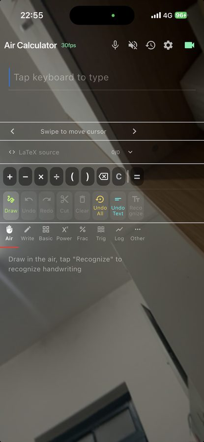
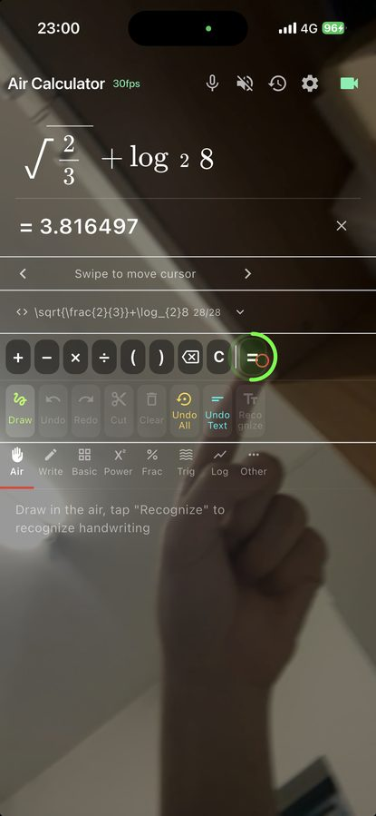
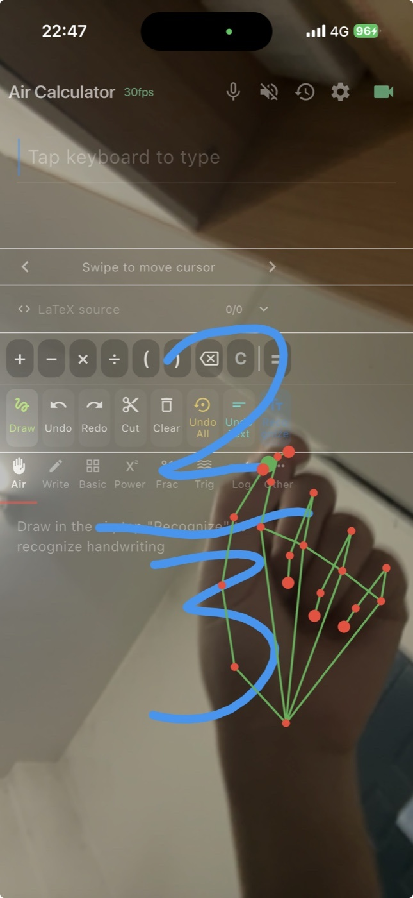
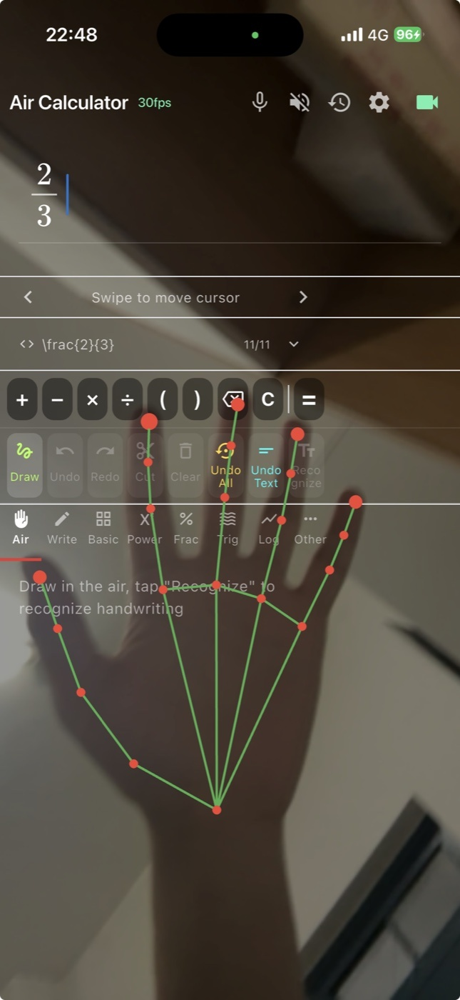
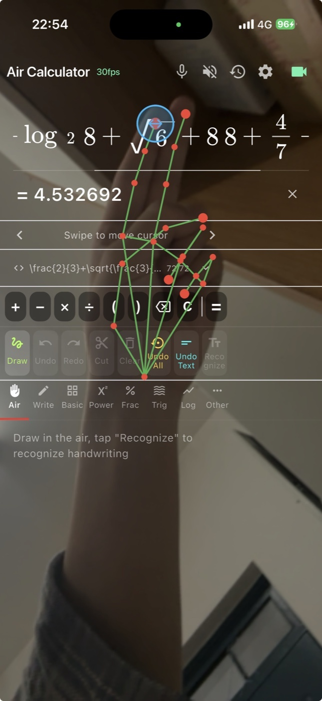
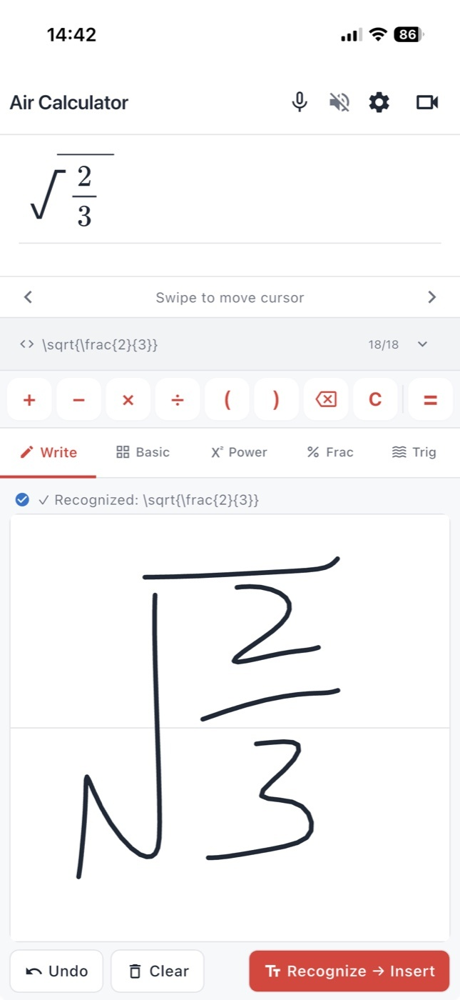
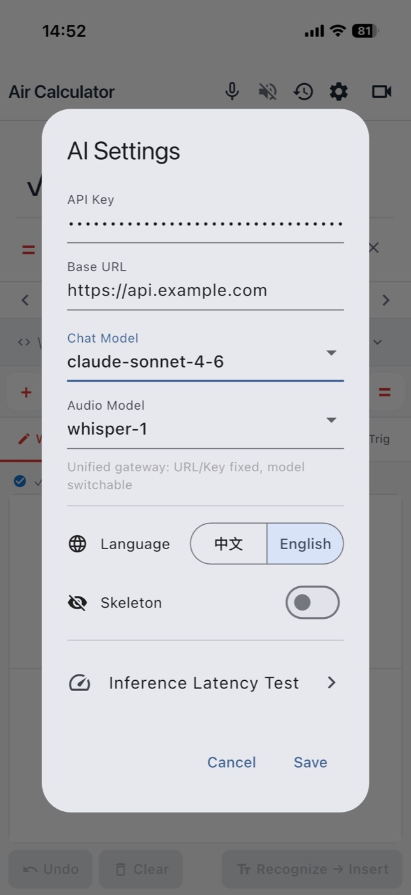
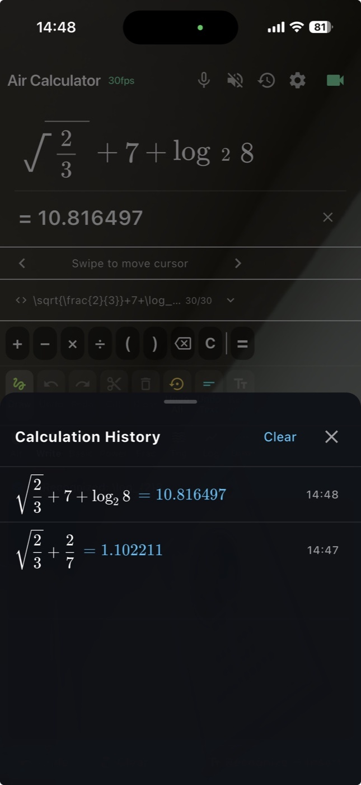
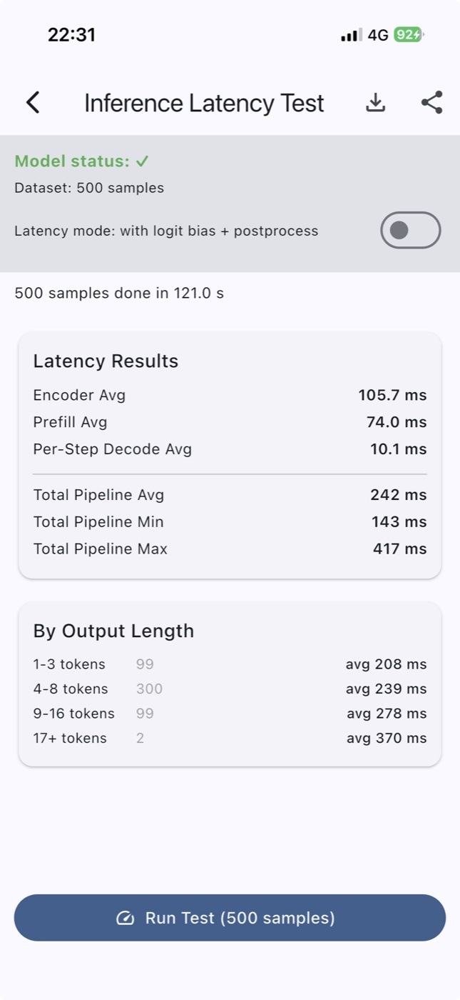

# air_calculator

空中手写计算器。摄像头里用手指在空中书写数学表达式，端侧识别成 LaTeX 并求值。

| 空闲 | 书写中 | 识别完成 |
|:---:|:---:|:---:|
|  |  |  |
| 等待抬手，画布显示提示 | 捏合落笔，实时绘制笔迹 | LaTeX 渲染 + 计算结果 + 语音播报 |

三态切换由捏合—释放—停笔状态机驱动，不需要额外操作。

## 功能

- 空中书写：手部关键点跟踪 + 捏合手势起落笔，绘制轨迹
- 手写识别：笔画序列 → LaTeX（decoder-only 模型，端侧推理）
- 触屏手写板与公式键盘，两种输入方式与空中书写共用同一条识别链路
- LaTeX 解析与数值计算，结果中文语音播报
- 语音指令
- 内置基准页：500 条样本跑端到端延迟与准确率，可导出报告

## 手势

除捏合书写外，还有三个复合手势触发系统级动作。判定阈值与帧节拍在
`lib/pages/formula_editor/gesture_logic.dart`。

|  |  |  |  |
|:---:|:---:|:---:|:---:|
| **捏合书写**<br>拇指食指捏合落笔，<br>指尖中点画轨迹 | **五指张开**<br>立即提交识别 | **双指并拢**<br>拖拽预览区<br>横向滚动看长公式 | **单指悬停**<br>停留触发按钮，<br>高风险按钮要停更久 |

## 界面

触屏与空中两种模式共用同一份公式状态，切换不丢编辑结果。差别只在控件布局：
触屏铺满全屏，空中把可点击控件约束在屏幕一侧，避开手部活动区免得误触。

|  |  |
|:---:|:---:|
| **触屏模式**<br>标题栏、公式预览区、光标拖动条、<br>LaTeX 源码行、快捷工具栏、符号面板 | **空中模式**<br>相机预览铺底，编辑器 UI 半透明靠边，<br>笔迹画布 / 手部骨架 / 悬停进度环三层叠加 |

另有三个辅助界面：

|  |  |  |
|:---:|:---:|:---:|
| **设置**<br>API Key、语言、骨架开关 | **历史**<br>停靠式底部面板，<br>点击回填、长按复制 | **基准测试**<br>JSONL 导出与统计报告 |

## 仓库关系

```
air_calculator                    本仓，Flutter 客户端
  ├── hand_camera/                相机与手部检测插件（CameraX / AVFoundation）
  ├── packages/aircalc_native/    核心库的 Dart 绑定与 build hook
  └── flutter_math_fork/          公式渲染（带光标插入）

../air_calculator-rs    识别核心、LaTeX 求值与 C ABI
../hand-track           手部检测流水线与两端权重
../edge-infer           推理抽象：Engine trait + LiteRT / Core ML 后端
../air_calculator_py    模型训练与端侧导出
```

几个仓要并排 checkout：Rust 侧是 path 依赖，客户端在 `pubspec.yaml` 的
`hooks.user_defines` 里给出核心库与运行时构件的绝对路径。

## 架构

```
相机帧 ──> hand_camera 插件 ──> aircalc 原生核心（Rust）
                                    │
                              关键点 21 点
                                    ▼
                            捏合判定 / 轨迹累积
                                    ▼
                          笔画 ──> 识别 ──> LaTeX ──> 求值
```

推理和求值都在 Rust 核心里完成，一次识别只跨一次 FFI 边界——解码的每一步不再
往返 Dart。识别跑在常驻 worker isolate 上，不占 UI 线程。

Rust 侧分三个 crate：

| crate | 职责 |
|---|---|
| `ink-hmer` | 笔画特征提取 + 解码循环 |
| `latex-calc` | LaTeX 词法 → 语法 → AST → 求值 |
| `aircalc-ffi` | C ABI，同时供 Dart / Swift / JNI 调用 |

识别模型是 **stroke-only** 的：输入只有笔画序列，没有渲染图那一路
（`vocab.json` 里 `n_prefix: 32`，即 32 个笔画 token）。

求值走任意精度有理数，四则运算、整数幂、阶乘、组合数、行列式全程精确，
遇到 `\sin`、`\ln`、开不尽的根才转浮点——`0.1+0.2` 精确等于 `0.3`，
`21!` 不会在 2^53 处失真。

后端按平台选，由核心库内部的 `Engine` 抽象抹平：

| | Android | iOS / macOS |
|---|---|---|
| 后端 | LiteRT 2.x（GPU 加速器） | 裸 Core ML（神经引擎） |
| 识别模型 | `.tflite` 双签名 | `.mlmodelc` 多函数 |
| 手部模型 | `.tflite` | `.mlmodelc` |

## 模型

权重不进 Git。`platform_models/` 放识别模型，手部模型来自 `hand-track` 仓。

```
platform_models/android/  prefix_enc.tflite  decoder.tflite  vocab.json
platform_models/ios/      prefix_enc.mlpackage  decoder.mlpackage  vocab.json
```

由 `air_calculator_py/export/` 下的脚本导出：

```bash
# Android
python3 export/export_tf_android_fp32.py --ckpt <ckpt> --data-dir <dataset>
# iOS / macOS
python3 export/export_coreml_ios.py --ckpt <ckpt> --data-dir <dataset> --max-decode 48
```

`--max-decode` 要与 Rust 侧的 `MAX_DECODE` 一致，否则解到一半会因 KV 缓冲越界
而失败。

构建前 `tool/copy_platform_models.sh <platform>` 把当前平台那份就位：Android 的
模型进 `assets/`；iOS 的识别模型与手部模型由 Xcode 的构建阶段用
`xcrun coremlcompiler` 编成 `.mlmodelc` 直接放进 app bundle，所以 iOS 的
`assets/models/` 里只有一个 `vocab.json`。

## 构建

```bash
# Android 首次：取 LiteRT 运行时
../edge-infer/scripts/fetch_litert.sh android-arm64

flutter pub get
flutter run --release -d <device>
```

Apple 侧不需要取任何运行时构件，`CoreML.framework` 是系统框架。

Rust 核心由 `packages/aircalc_native` 的 build hook 编译，不需要单独构建。

## 权限

相机（空中书写）、麦克风（语音指令）。iOS 在 `Info.plist`、Android 在
`AndroidManifest.xml`，首次进入对应功能时申请。

## License

Apache License 2.0 — see `LICENSE` and `NOTICE`.

The code is free to use, modify, redistribute and commercialize, including
publishing derivative applications on the App Store, Google Play or anywhere
else. Per section 6 of the Apache License 2.0, no trademark or product name
rights are granted: **Air Calculator**, **AirCalculator**, `air_calculator` as
a product name, and the application icons and logos in this repository are
reserved, and may not be used to publish or promote a derivative work without
prior written permission. Fork it, but ship it under your own name. Factual
references such as "based on Air Calculator" are fine, as long as they do not
suggest endorsement.
